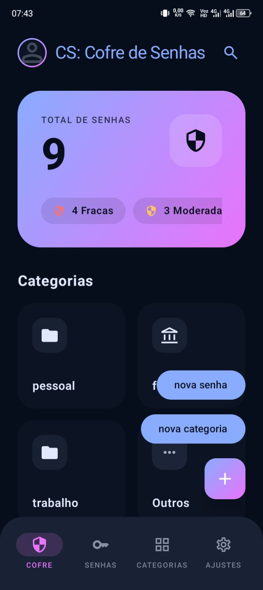
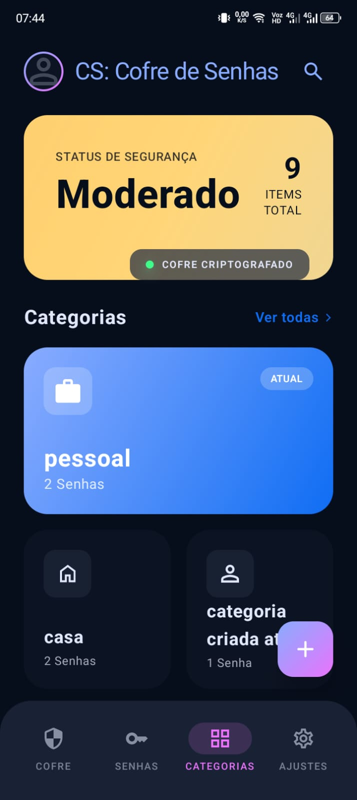
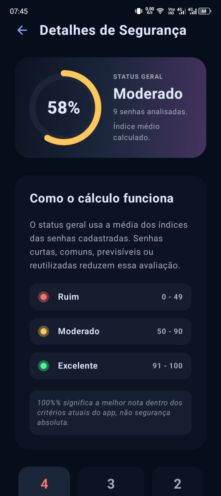
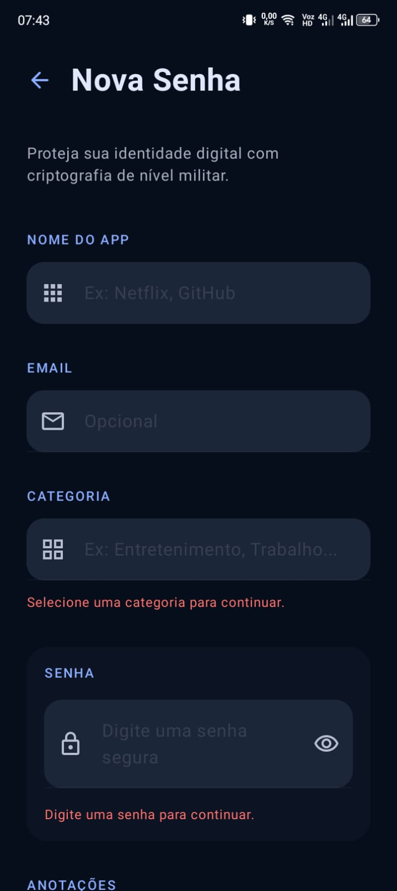
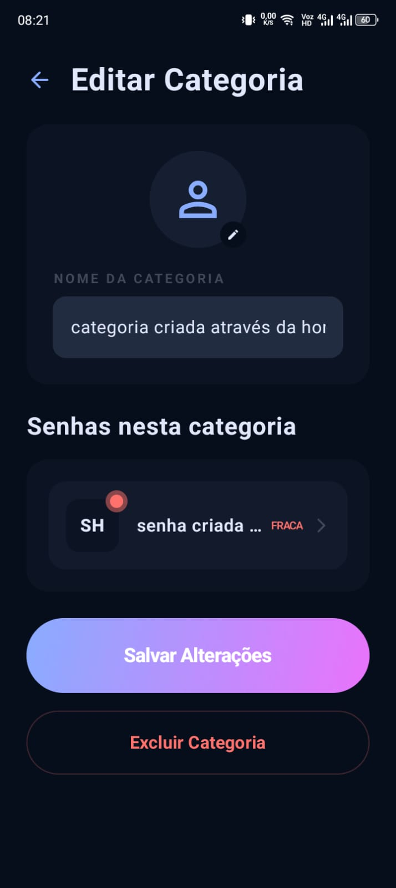
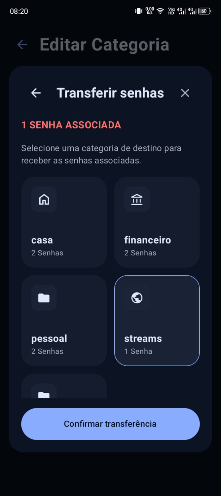
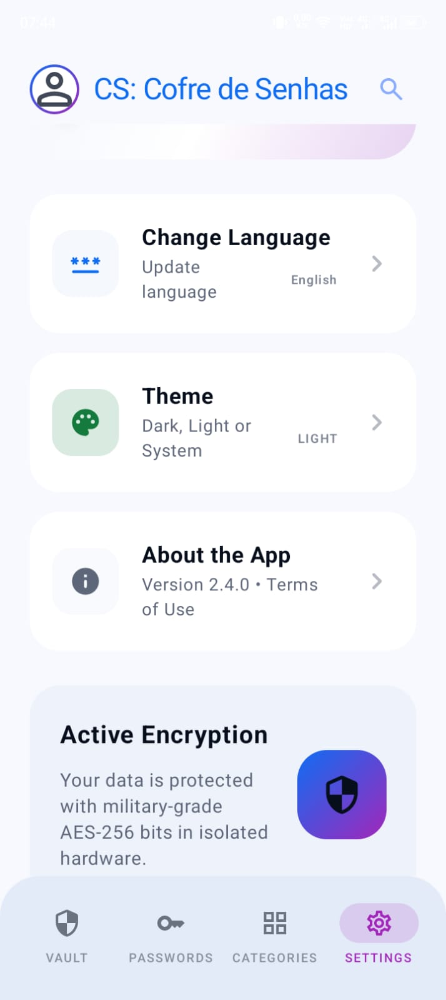
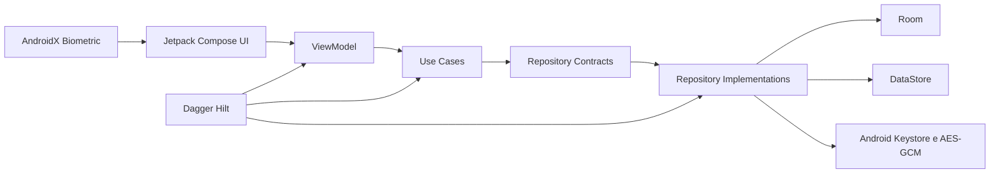

<div align="center">

# 🔐 Seu Cofre — Gerenciador de Senhas

Aplicativo Android nativo, local-first, para armazenar, organizar e avaliar credenciais com foco em segurança, arquitetura sustentável e boa experiência de uso.

[](https://developer.android.com/)
[](https://kotlinlang.org/)
[](https://developer.android.com/compose)
[](https://developer.android.com/)
[](#estado-do-projeto)

</div>

---
## Sobre o projeto


O **Seu Cofre** é um gerenciador de senhas Android desenvolvido em Kotlin com Jetpack Compose. O projeto prioriza, nesta ordem, segurança, corretude, manutenção de longo prazo, testabilidade, experiência do usuário e performance.

As credenciais são mantidas localmente no dispositivo. A senha é criptografada antes da persistência no Room, usando `AES/GCM/NoPadding` e uma chave gerenciada pelo Android Keystore. O aplicativo também organiza credenciais por categorias, oferece pesquisa global, calcula um índice de segurança e protege telas de edição com autenticação local.

> O projeto é orientado a produção, mas ainda está em desenvolvimento e não possui uma release pública final.

## Sumário

- [Demonstração](#demonstração)
- [Principais funcionalidades](#principais-funcionalidades)
- [Como usar o aplicativo](#como-usar-o-aplicativo)
- [Segurança e privacidade](#segurança-e-privacidade)
- [Arquitetura](#arquitetura)
- [Tecnologias](#tecnologias)
- [Requisitos](#requisitos)
- [Instalação e execução](#instalação-e-execução)
- [Testes e validações](#testes-e-validações)
- [Estrutura do projeto](#estrutura-do-projeto)
- [Documentação técnica](#documentação-técnica)
- [Estado do projeto](#estado-do-projeto)
- [Contribuição](#contribuição)
- [Licença](#licença)

## Demonstração

As imagens abaixo utilizam dados demonstrativos e podem apresentar pequenas diferenças em relação à versão mais recente da interface.

<p align="center">
  
  
  
</p>

<p align="center">
  
  
  
</p>

<p align="center">
  
</p>

## Principais funcionalidades

- Cofre local com visão geral das credenciais e do estado de segurança.
- Cadastro, consulta e edição de credenciais.
- Organização por categorias personalizadas.
- Transferência de credenciais antes da exclusão ou reorganização de categorias.
- Pesquisa global de senhas e categorias.
- Índice de segurança com classificação visual das credenciais.
- Detecção local de reutilização exata de senha sem armazenar o segredo em texto puro.
- Autenticação local nas telas de edição por biometria forte ou credencial segura do dispositivo.
- Tema claro, escuro ou conforme o sistema.
- Interface internacionalizada em português, inglês e espanhol.
- Preferências não sensíveis persistidas com DataStore.
- Interface declarativa construída integralmente com Jetpack Compose e Material 3.

## Como usar o aplicativo

1. Abra a aba **Cofre** para visualizar o total de credenciais, as categorias e o resumo de segurança.
2. Crie uma categoria para organizar credenciais por contexto, como pessoal, trabalho ou financeiro.
3. Use a ação de nova senha para informar o serviço, identificador, categoria, senha e demais dados da credencial.
4. Consulte a aba **Senhas** ou utilize a pesquisa global para localizar uma credencial.
5. Abra **Categorias** para visualizar a distribuição das senhas e acessar o detalhamento da avaliação de segurança.
6. Ao editar uma senha ou categoria, confirme sua identidade com biometria ou bloqueio seguro do dispositivo.
7. Em **Ajustes**, escolha idioma, tema e nome de exibição.

Ao excluir uma categoria que ainda possui credenciais, o aplicativo permite transferi-las para outra categoria antes de concluir a operação.

## Segurança e privacidade

Segurança é uma responsabilidade central do projeto, não uma camada adicionada ao final.

| Proteção | Implementação |
|---|---|
| Criptografia em repouso | A senha é criptografada antes da persistência usando `AES/GCM/NoPadding`. |
| Gerenciamento de chaves | A chave criptográfica é criada e mantida pelo Android Keystore. |
| Persistência | O Room armazena o texto cifrado, o IV, a versão da cifra e uma fingerprint para comparação segura. |
| Detecção de duplicidade | Uma fingerprint HMAC-SHA256 permite detectar reutilização exata sem descriptografar o cofre inteiro. |
| Autenticação local | Telas de edição usam AndroidX Biometric com `BIOMETRIC_STRONG | DEVICE_CREDENTIAL`. |
| Carregamento protegido | Dados persistidos das telas de edição só são carregados após autenticação bem-sucedida. |
| Backup | O banco do cofre, incluindo arquivos WAL e SHM, é excluído do backup automático e da transferência entre dispositivos. |
| Preferências | Tema, idioma e nome de exibição usam DataStore e não armazenam segredos do cofre. |
| Dados demonstrativos | Previews, documentação e testes não devem conter credenciais reais. |

### Limites importantes

- O Android Keystore protege o material criptográfico, mas o suporte a armazenamento realmente isolado por hardware depende do dispositivo.
- Autenticação biométrica e criptografia cumprem funções diferentes; uma não substitui a outra.
- O índice exibido pelo aplicativo é uma estimativa baseada nos critérios atuais do projeto. Uma nota de 100% não representa segurança absoluta.
- O projeto não deve ser considerado auditado independentemente.
- O núcleo atual é local-first e não depende de um backend para armazenar credenciais.

Mais detalhes estão disponíveis em [`docs/security.md`](docs/security.md), [`docs/password-encryption-persistence.md`](docs/password-encryption-persistence.md) e [`docs/local-authentication-edit-screens.md`](docs/local-authentication-edit-screens.md).

## Arquitetura

O projeto segue **MVVM + Clean Architecture**, com organização por feature e separação explícita entre apresentação, domínio e dados.



### Responsabilidades das camadas

| Camada | Responsabilidade |
|---|---|
| `presentation` | Composables, `UiState`, eventos, efeitos, ViewModels e navegação. |
| `domain` | Modelos de negócio, contratos de repositório, validações e casos de uso. |
| `data` | Room, DataStore, criptografia, mapeadores e implementações de repositório. |
| `core` | Infraestrutura e componentes compartilhados entre features. |

O fluxo principal segue a direção:

```text
Compose UI
  -> ViewModel
  -> UseCase
  -> Repository
  -> Data Source
  -> Domain Model
  -> UiState
  -> Compose UI
```

Princípios utilizados:

- Unidirectional Data Flow.
- Single Source of Truth.
- Injeção por construtor com Hilt.
- Leitura e escrita assíncronas com Coroutines e Flow.
- Coleta de estado lifecycle-aware.
- Entidades Room e detalhes de infraestrutura isolados da UI.
- Mudanças pequenas, reversíveis e testáveis.

## Tecnologias

| Tecnologia | Uso no projeto | Versão/configuração atual |
|---|---|---|
| Kotlin | Linguagem principal | `2.0.21` |
| Jetpack Compose | Interface declarativa | BOM `2024.09.00` |
| Material 3 | Design system e componentes | Gerenciado pelo Compose BOM |
| Navigation Compose | Navegação entre telas | `2.8.0` |
| Dagger Hilt | Injeção de dependências | `2.57.2` |
| Room | Persistência relacional local | `2.7.2` |
| DataStore Preferences | Preferências não sensíveis | `1.2.1` |
| AndroidX Biometric | Autenticação local | `1.1.0` |
| Coroutines e Flow | Assincronismo e estado reativo | Stack Kotlin/AndroidX |
| KSP | Geração de código do Room | `2.0.21-1.0.28` |
| KAPT | Geração de código do Hilt | Kotlin `2.0.21` |
| Android Gradle Plugin | Build Android | `8.12.3` |
| Gradle Wrapper | Automação do build | `8.13` |
| Android SDK | Compilação e destino | `compileSdk 36`, `targetSdk 36` |
| Compatibilidade Android | Versão mínima | `minSdk 24` |
| Java bytecode | Source e target do módulo | Java `11` |

## Requisitos

Para desenvolver e executar o projeto:

- Git.
- Android Studio compatível com AGP `8.12.3`.
- JDK 17 para executar o Gradle/Android Gradle Plugin.
- Android SDK Platform 36.
- Android Build Tools `36.0.0`.
- Emulador ou dispositivo com Android 7.0, API 24, ou superior.

O aplicativo não exige chave de API, backend ou variável de ambiente de runtime para funcionar.

## Instalação e execução

### 1. Clone o repositório

```bash
git clone https://github.com/wpmello/Seu-Cofre-Gerenciador-de-Senhas.git
cd Seu-Cofre-Gerenciador-de-Senhas
```

### 2. Abra no Android Studio

1. Selecione **Open**.
2. Escolha a pasta do repositório.
3. Aguarde a sincronização do Gradle.
4. Confirme que a plataforma Android 36 e o Build Tools 36.0.0 estão instalados.
5. Selecione um emulador ou dispositivo com API 24 ou superior.
6. Execute a configuração `app`.

### 3. Gere o APK de debug pela linha de comando

Linux, macOS ou Git Bash:

```bash
./gradlew assembleDebug
```

Windows PowerShell:

```powershell
.\gradlew.bat assembleDebug
```

O APK será gerado em:

```text
app/build/outputs/apk/debug/app-debug.apk
```

### 4. Instale em um dispositivo conectado

Linux, macOS ou Git Bash:

```bash
./gradlew installDebug
```

Windows PowerShell:

```powershell
.\gradlew.bat installDebug
```

Verifique antes se o dispositivo aparece no ADB:

```bash
adb devices
```

## Testes e validações

### Testes unitários

```bash
./gradlew testDebugUnitTest
```

No Windows:

```powershell
.\gradlew.bat testDebugUnitTest
```

### Testes instrumentados

Requer um emulador ou dispositivo conectado:

```bash
./gradlew connectedDebugAndroidTest
```

No Windows:

```powershell
.\gradlew.bat connectedDebugAndroidTest
```

### Análise estática

```bash
./gradlew lint
```

### Verificação do build de release

```bash
./gradlew assembleRelease
```

A estratégia do projeto prevê testes para ViewModels, regras de domínio, persistência Room, DataStore, navegação, autenticação local, criptografia e comportamentos Compose.

Consulte [`docs/testing.md`](docs/testing.md) para as regras de testes e critérios de qualidade.

## Estrutura do projeto

```text
.
├── app/
│   ├── schemas/                         # Schemas versionados do Room
│   └── src/
│       ├── main/
│       │   ├── java/com/inovalou/seucofregerenciadordesenhas/
│       │   │   ├── core/                # Infraestrutura e componentes compartilhados
│       │   │   ├── feature/             # Features organizadas por contexto
│       │   │   └── navigation/          # Grafo e shell principal de navegação
│       │   └── res/                     # Recursos, traduções, temas e regras de backup
│       ├── test/                         # Testes unitários
│       └── androidTest/                  # Testes instrumentados
├── docs/
│   ├── adr/                              # Architecture Decision Records
│   ├── images/                           # Imagens utilizadas neste README
│   └── *.md                              # Documentação técnica e operacional
├── gradle/
│   ├── libs.versions.toml                # Catálogo de versões
│   └── wrapper/                          # Gradle Wrapper
├── AGENTS.md                             # Regras duráveis de engenharia do repositório
├── Dockerfile                            # Ambiente auxiliar de desenvolvimento
├── docker-compose.yml                    # Configuração auxiliar para Codex
└── README.md
```

O Docker não é necessário para compilar ou executar o aplicativo. Os arquivos de container existentes são ferramentas auxiliares do fluxo de desenvolvimento com Codex.

## Documentação técnica

A documentação detalhada permanece em `docs/`:

- [`AGENTS.md`](AGENTS.md) — prioridades, padrões e regras duráveis do repositório.
- [`docs/architecture.md`](docs/architecture.md) — arquitetura e responsabilidades das camadas.
- [`docs/security.md`](docs/security.md) — política geral de segurança e privacidade.
- [`docs/testing.md`](docs/testing.md) — estratégia de testes.
- [`docs/password-encryption-persistence.md`](docs/password-encryption-persistence.md) — persistência criptografada.
- [`docs/local-authentication-edit-screens.md`](docs/local-authentication-edit-screens.md) — autenticação local nas telas de edição.
- [`docs/password-strength-security-policy-v1.md`](docs/password-strength-security-policy-v1.md) — política do índice de segurança.
- [`docs/settings-preferences.md`](docs/settings-preferences.md) — tema, idioma e preferências.
- [`docs/bottom-navigation-top-level-destinations.md`](docs/bottom-navigation-top-level-destinations.md) — destinos principais e regras de navegação.
- [`docs/design-system-operational-source-of-truth.md`](docs/design-system-operational-source-of-truth.md) — fonte operacional do design system.
- [`docs/release.md`](docs/release.md) — processo e critérios de release.
- [`docs/adr/`](docs/adr/) — decisões arquiteturais registradas.

## Estado do projeto

O projeto está em desenvolvimento ativo.

### Implementado

- Cadastro e edição de credenciais.
- Persistência criptografada no Room.
- Categorias e transferência de credenciais.
- Pesquisa global.
- Resumo e detalhes de segurança.
- Autenticação local em telas de edição.
- Tema e idioma persistidos com DataStore.
- Recursos em português, inglês e espanhol.

### Limitações atuais

- Não há sincronização em nuvem ou backend.
- Não existe fluxo público de importação ou exportação segura do cofre.
- O banco é excluído do backup automático; ainda não há um mecanismo próprio de backup e recuperação.
- Não há release pública publicada.
- O build `release` atual mantém `isMinifyEnabled = false`; o hardening com R8 deve ser concluído e validado antes de uma distribuição de produção.
- O repositório ainda não possui uma licença pública definida.

## Contribuição

Antes de alterar o projeto, leia [`AGENTS.md`](AGENTS.md) e a documentação relacionada à feature.

Fluxo recomendado:

```bash
git checkout -b feat/nome-da-mudanca
```

Ao enviar uma mudança:

- preserve a separação entre `presentation`, `domain` e `data`;
- não persista nem registre dados sensíveis em texto puro;
- adicione ou atualize testes proporcionais ao risco;
- valide build, testes e lint;
- atualize a documentação quando a decisão afetar arquitetura, segurança ou comportamento público;
- evite alterações não relacionadas no mesmo conjunto de mudanças.

## Licença

Este repositório ainda não possui um arquivo `LICENSE`.

Até que uma licença seja adicionada, o código não deve ser presumido como livre para uso, modificação ou redistribuição fora dos direitos concedidos explicitamente pelo autor.

---

<div align="center">

Desenvolvido por [@wpmello](https://github.com/wpmello)

**Segurança, previsibilidade e evolução sustentável.**

</div>
